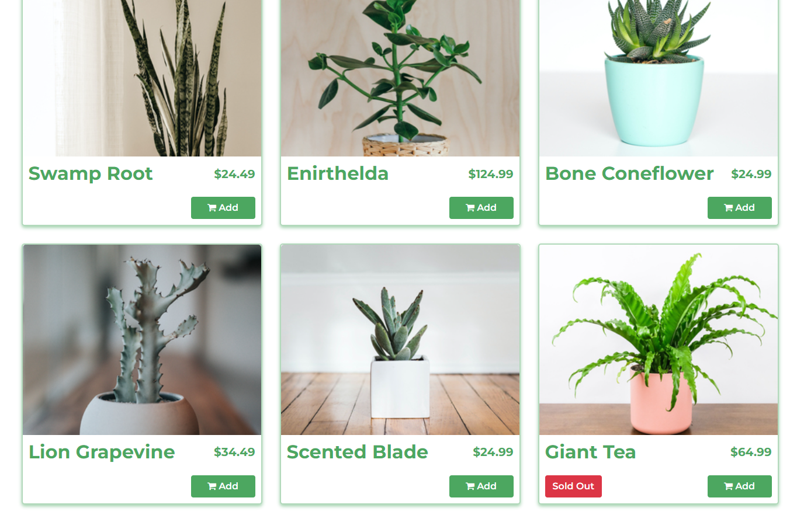
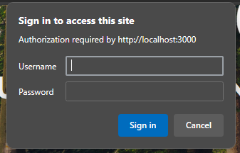
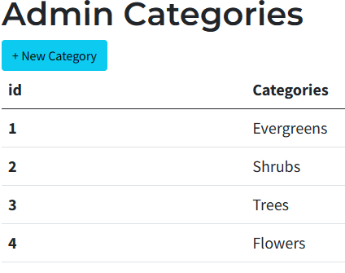
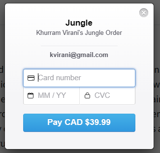
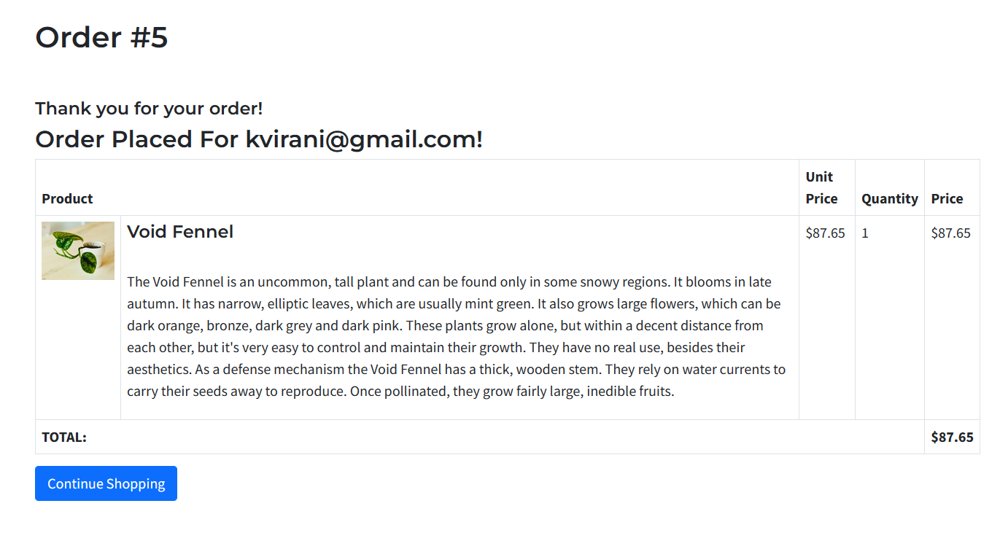

# Jungle

A mini e-commerce application built with Rails 6.1 for purposes of teaching Rails by example.

## Setup

1. Run `bundle install` to install dependencies
2. Create `config/database.yml` by copying `config/database.example.yml`
3. Create `config/secrets.yml` by copying `config/secrets.example.yml`
4. Run `bin/rails db:reset` to create, load and seed db
5. Create .env file based on .env.example
6. Sign up for a Stripe account
7. Put Stripe (test) keys into appropriate .env vars
8. Run `bin/rails s -b 0.0.0.0` to start the server

## Database

If Rails is complaining about authentication to the database, uncomment the user and password fields from `config/database.yml` in the development and test sections, and replace if necessary the user and password `development` to an existing database user.

## Stripe Testing

Use Credit Card # 4111 1111 1111 1111 for testing success scenarios.

More information in their docs: <https://stripe.com/docs/testing#cards>

## Dependencies

- Rails 6.1 [Rails Guide](http://guides.rubyonrails.org/v6.1/)
- Bootstrap 5
- PostgreSQL 9.x
- Stripe

## Information

<h3>Welcome to The Jungle!</h3>

</img>

<h4>The Jungle is a project where I got to experience being a junior developer in a new company with a new tech stack. The premise is that I would be given tasks to implement into the codebase and have it up and running! Let's see a few examples!</h4>

<h4>In this example, I had to implement a "Sold Out" segment when there was no inventory in the system:</h4>

</img>

<h4>I also had to implement a basic user authentication with login/logout functions with encrypted passwords!:</h4>

</img>

<h4>I've also protected the Admin pages with authentication as well:</h4>

</img>

<h4>Once inside the admin pages, I've implemented a page where the admin can create a category section to organize inventory:</h4>

</img>

<h4>I've also got to implement testing with Stripe with their testing api to successfully place an order:</h4>

</img>

<h4>I was also able to create a page where verification of a purchase was successful:</h4>

</img>

<h4>This was one of my favorite projects because it emulated the real world and felt really productive!</h4>

<h4>Cool!!!</h4>

